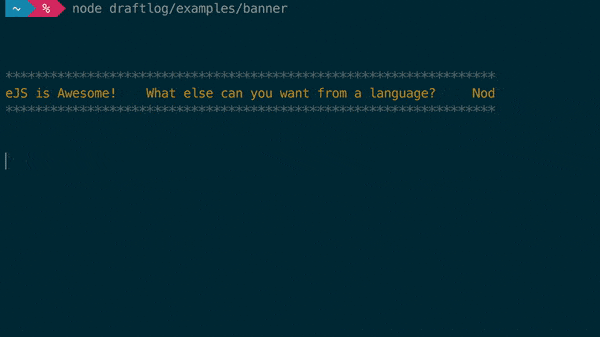

<!-- [![NPM][npm-image]][npm-url] -->

[![Build Status][build-status-image]][build-status-url] [![Dependency Status][dependencies-image]][dependencies-url]

Because Logging can be pretty and fun



[build-status-image]: https://img.shields.io/travis/ivanseidel/node-draftlog.svg
[build-status-url]: http://travis-ci.org/ivanseidel/node-draftlog
[dependencies-image]: https://gemnasium.com/badges/github.com/ivanseidel/node-draftlog.svg
[dependencies-url]: https://gemnasium.com/github.com/ivanseidel/node-draftlog
[npm-image]: https://nodei.co/npm/draftlog.png?downloads=true&stars=true
[npm-url]: https://nodei.co/npm/draftlog

## Installation

```
$ npm install draftlog
```

## What it does

It allows you to re-write a line of your log after being written. Just like post 'updating'.

It does that by keeping track of the current lines of code written thorugh the `stream`, and
moving the cursor up to the line of the `LogDraft` you created previously, and updating it's content.

How the
[HECK](http://ascii-table.com/ansi-escape-sequences-vt-100.php) is 
[that](https://en.wikipedia.org/wiki/ANSI_escape_code) even
[possible](http://tldp.org/HOWTO/Bash-Prompt-HOWTO/x361.html)?

## Usage

```javascript
// Setup
const DraftLog = require('draftlog')
DraftLog(console)

// Or, in a single line:
require('draftlog').into(console)
```

To create a updatable log, use the `draft` method injected into the provided `console`:

```javascript
// Create a Draft log
var update = console.draft('Hy, my name is')

// You can call logs after it
console.log('Something else')

// Use the received callback to update it as many times as you want
update('Hy, my name is Ivan!')
```

Here is some interesting exemples:
```javascript
// Prints a clock incrementing one every second in the same line
var draft = console.draft()
var elapsed = 1
setInterval( () => {
  draft('Elapsed', elapsed++, 'seconds')
}, 1000)

console.log('It doesn`t matter')
console.log('How \n many \n lines \n ituses')
```

Or maybe, to show an flow process?
```javascript
function someAsyncFunction(){ 
  var TAG = '[someAsyncFunction]'
  var log = console.draft(TAG, 'init')

  function a() {
    setTimeout(() => {
      log(TAG, 'calling b')
      b()
    }, 500)
  }

  function b() {
    setTimeout(() => {
      log(TAG, 'finished')
    })
  }
}
```

You can create your own progress bar, just like "that":

```javascript
require('draftlog').into(console)

// Input progess goes from 0 to 100
function ProgressBar(progress) {
  // Make it 50 characters length
  var units = Math.round(progress / 2)
  return '[' + '='.repeat(units) + ' '.repeat(50 - units) + '] ' + progress + '%'
}

var barLine = console.draft('Starting download...')
downloadFile(function (progress) {
  barLine(ProgressBar(progress))
})

// Will show something like: (being updated in realtime)
// [============================                      ] 56%
```

## Learn from examples!

We have a few of them ready for you to use! Take a look at [the examples folder](examples/).
Remember to replace `require('../')` with `require('draftlog')`.

Also, install [`chalk`](https://github.com/chalk/chalk) to get colors on your terminal ;)

## Important things to know

Because of the way Terminals are built, it is not possible to update a text outside the viewing area of the terminal.

That said, DraftLogs are setup to automagically be rewritten on a new line if they reach the end of the viewport.
Note that, you can disable that behavior, by setting `DraftLog.defaults.canReWrite = false`

Also, if the NodeJS environment cannot detect the number of rows of your terminal automatically, it will use
the default height on `DraftLog.defaults.maximumLinesUp`. Modify that if needed.


## Discouragements

This library is awesome for development, `cli` tools and what ever you want to created, that is NOT an
optmized "slave" server. Please, disable it passing `true` as a seccond parameter to the DraftLog initialization:

```javascript
// Disable Initialization (true = production; false = development)
DraftLog(console, true)
// Or, with one line require-init:
require('draftlog').into(console, true)
```

### Creator
[Ivan Seidel](https://github.com/ivanseidel)